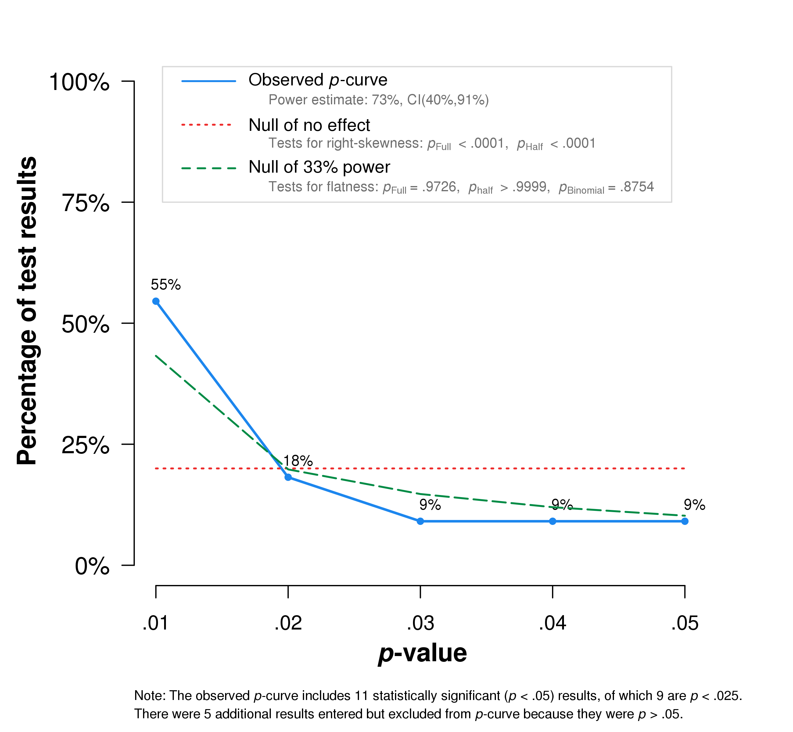
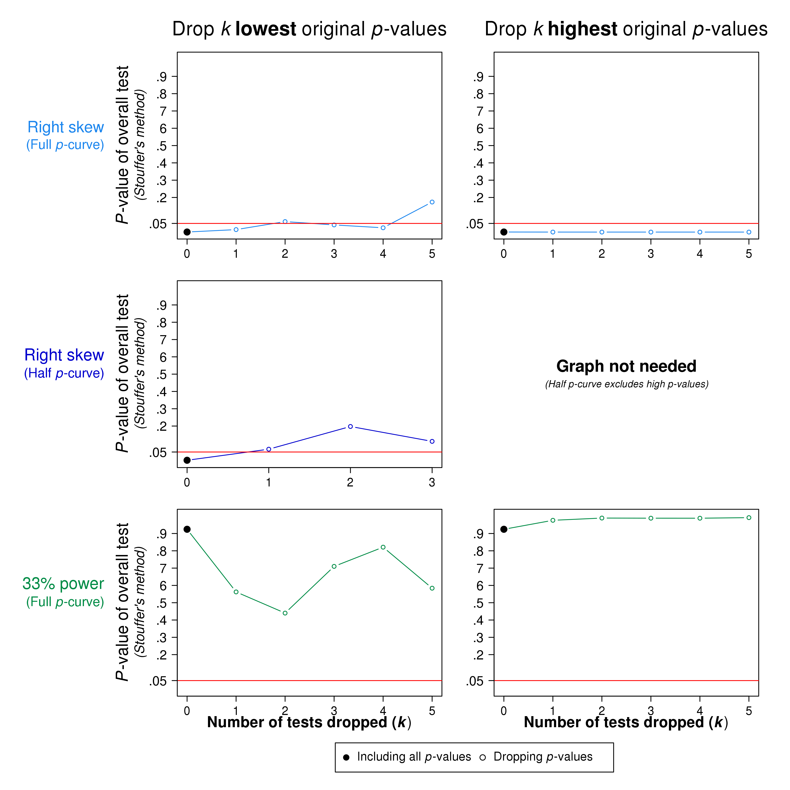

```{r setup, echo=FALSE}
knitr::opts_chunk$set(warning = FALSE)
knitr::opts_chunk$set(error = FALSE)
knitr::opts_chunk$set(tidy = TRUE)
knitr::opts_chunk$set(message = FALSE)
knitr::opts_chunk$set(fig.width = 8)
```

## About

This markdown describes analyses using the R packages **`meta`** [@schwarzer2015meta], **`metafor`** [@viechtbauer2010conducting] and functions described in Harrer & Ebert [2018](https://bookdown.org/MathiasHarrer/Doing_Meta_Analysis_in_R/). 

## Meta-Analysis (Overall Analysis)

Knapp-Hartung-adjustments are used.

```{r}
library(meta)
library(metafor)
library(knitr)
library(kableExtra)
library(dplyr)
library(esc)

load(file="Meta_Analysis_Data.RData")
m<-metagen(TE,
           seTE,
           data=Meta_Analysis_Data,
           studlab=paste(Author),
           comb.fixed = FALSE, 
           method.tau = "DL",
           hakn=TRUE, 
           prediction=TRUE)

```


**Forest Plot**

```{r, out.width="80%",fig.align='center'}
forest(m,prediction = TRUE,
       col.predict = "blue",
       fontsize=8,spacing=0.6,
       squaresize = 0.8,
       weight.study = "random",
       xlab = "Hedges'g",
       xlim=c(-0.5,2.0), 
       leftlabs = c("Study”,”g”,”SE"),
       label.left = "favors control",
       print.I2.ci = TRUE,
       print.zval = TRUE,
       digits.se = 3,
       print.tau2 = FALSE,
       sortvar = TE)
```


##Sensitivity Analyses

### Outliers removed

As a sensitivity analysis, the pooling is repeated while excluding the identified outliers *Danitz & Orsillo* and *Shapiro* (study 3 and study 16). See "Outlier Detection & Influence Analysis".

```{r}
ma.data.or<-as.data.frame(Meta_Analysis_Data[-c(3,16),])
m.ma.data.or<-metagen(TE,
           seTE,
           data=ma.data.or,
           studlab=paste(Author),
           comb.fixed = FALSE, 
           method.tau = "DL",
           hakn=TRUE, 
           prediction=TRUE)
```           


**Forest Plot**
    
```{r}
forest(m.ma.data.or,prediction = TRUE,
       col.predict = "blue",
       fontsize=8,spacing=0.6,
       squaresize = 0.8,
       weight.study = "random",
       xlab = "Hedges'g",
       xlim=c(-0.5,2.0), 
       leftlabs = c("Study”,”g”,”SE"),
       label.left = "favors control",
       print.I2.ci = TRUE,
       print.zval = TRUE,
       digits.se = 3,
       print.tau2 = TRUE)
```


### Only low risk of bias

In this sensitivity analysis, only studies with a low risk of bias are included.

```{r}
ma.data.lrb <- filter(Meta_Analysis_Data, RoB == "low")
m.ma.data.lrb<-metagen(TE,
           seTE,
           data=ma.data.lrb,
           studlab=paste(Author),
           comb.fixed = FALSE, 
           method.tau = "DL",
           hakn=TRUE, 
           prediction=TRUE)
m.ma.data.lrb
```

**Forest Plot**
    
```{r}
forest(m.ma.data.lrb,
       prediction = TRUE,
       col.predict = "blue",
       fontsize=8,spacing=0.6,
       squaresize = 0.8,
       weight.study = "random",
       xlab = "Hedges'g",
       xlim=c(-0.5,2.0), 
       leftlabs = c("Study”,”g”,”SE"),
       label.left = "favors control",
       print.I2.ci = TRUE,
       print.zval = TRUE,
       digits.se = 3,
       print.tau2 = TRUE)
```


## Outlier Detection & Influence Analysis {#odia}

### Outlier Detection

A study is defined as outlying when its 95%CI lies entire outside the one of the pooled effect.

```{r}
source("spot.outliers.R")
spot.outliers.random(data = m)
```

### Influence Analysis
  
```{r, out.width='50%'}

m.inf<-metainf(m,pooled="random")
forest(metainf(m),
       rightcols = c("TE","I2"),
       rightlabs=c("g","I-squared"),
       col.predict = "black",
       fontsize=8,spacing=0.6,
       squaresize = 0.8,
       xlab = "Hedges'g",
       xlim=c(0,2), 
       label.left = "favors control",
       digits.I2 = 2,
       sortvar = I2)

m.metafor<-rma(TE,seTE,data=Meta_Analysis_Data, method = "DL",test = "knha")
inf <- influence(m.metafor)
plot(inf)
```
  
**Baujat-Plot [@baujat2002graphical]**
  
```{r, out.width="60%",fig.align='center'}
baujat(m,
       studlab = TRUE,
       cex.studlab = 1)
```
  
  
*Study 3* (Danitz & Orsillo, 2014) and *Study 16* (Shapiro et al., 2011) are identified as outliers.


## Publication bias

###Egger's Test of the intercept

```{r}
m.eggers<-metabias(m, method.bias = "linreg")
m.eggers
```

What it the CI of the intercept (bias)?


```{r, echo=FALSE}
m.df<-as.data.frame(m.eggers$estimate)
bias<-m.df[1,]
se.bias<-m.df[2,]
UL.bias<-bias+1.96*se.bias
LL.bias<-bias-1.96*se.bias
```


The ULCI of the intercept is

```{r, echo=FALSE}
UL.bias
```


Das LLCI of the intercept is


```{r, echo=FALSE}
LL.bias
```


###Funnel Plot
  
  
```{r, out.width="50%"}
#Print Funnel-Plot with study labels
funnel(m, 
       comb.random=TRUE, 
       pch=16, 
       studlab=TRUE, 
       cex.studlab = 0.5,
       contour=c(0.9, 0.95, 0.99),
       xlab="Hedges' g", 
       col.contour=c("darkgray", "gray","lightgray"))
legend(0.7,0,
       c("0.1 > p > 0.05", "0.05 > p > 0.01", "p< 0.01"),
       cex = 0.8, 
       fill=c("darkgray", "gray","lightgray"), 
       bty="n")

#Print Funnel-Plot without study labels
funnel(m, 
       comb.random=TRUE, 
       pch=16, studlab=FALSE, 
       cex.studlab = 0.5,
       contour=c(0.9, 0.95, 0.99),
       xlab="Hedges' g", 
       col.contour=c("darkgray", "gray","lightgray"))
legend(0.7,0,
       c("0.1 > p > 0.05", "0.05 > p > 0.01", "p< 0.01"),
       cex = 0.8, 
       fill=c("darkgray", "gray","lightgray"), 
       bty="n")
```


###Duval & Tweedie Trim-and-Fill procedure

```{r}
#Duval & Tweedie Trim-and-fill
trimfillm<-trimfill(m)
print(trimfillm)
```

Funnel plot with imputed studies

```{r, out.width="50%"}
# with study labels
funnel(trimfillm, comb.random=TRUE, studlab=TRUE, cex.studlab = 0.5,contour=c(0.9, 0.95, 0.99),xlab="Hedges' g", col.contour=c("darkgray", "gray","lightgray"))
legend(0.7,0,c("0.1 > p > 0.05", "0.05 > p > 0.01", "p< 0.01"),cex = 0.8, fill=c("darkgray", "gray","lightgray"), bty="n")
# without study labels
funnel(trimfillm, comb.random=TRUE, studlab=FALSE, cex.studlab = 0.5,contour=c(0.9, 0.95, 0.99),xlab="Hedges' g", col.contour=c("darkgray", "gray","lightgray"))
legend(0.7,0,c("0.1 > p > 0.05", "0.05 > p > 0.01", "p< 0.01"),cex = 0.8, fill=c("darkgray", "gray","lightgray"), bty="n")
```


### P-Curve

Publication bias (selective reporting) is now inspected through P-Curves [@simonsohn2014p;@simonsohn2015better;@van2016conducting].

```{r}
load(file = "pcurvedata.RData")
# pcurvedata$t_obs<-round(pcurvedata$t_obs, digits = 2)
# tot<-data.frame(paste("t(",pcurvedata$df_obs,")=",pcurvedata$t_obs))
# colnames(tot)<-c("output")
# tot$output<-gsub(" ", "", tot$output, fixed = TRUE)
# totoutput<-as.character(tot$output)
# print(tot, row.names = FALSE)
# write(totoutput,ncolumns=1, file="input.txt")

# Get working directory path
# wd<-getwd()

# source("pcurve_app.R")
# pcurve_app("input.txt", wd)

```


```{r, out.width='50%'}


```


**Estimation of the true effect using P-Curve**

  
```{r, out.width="50%", fig.align='center'}
load(file="pcurvedata.RData")
source("plotloss.R")
t_obs<-pcurvedata$t_obs
df_obs<-pcurvedata$df_obs


#estimation
plotloss(t_obs=t_obs,df_obs=df_obs,dmin=-.5,dmax=2)
```


**Estimation of the true effect using P-Curve - without outliers**
  
According to Van Aert [@van2016conducting], effect size estimates using p-curve may be distorted if heterogeneity is high (i.e., $I^{2}>$ 50%). This is the case in the main analysis. Therefore, the effect size is estimated again without outliers.

```{r, out.width="50%", fig.align='center'}
load(file="pcurvedata.RData")
source("plotloss.R")
pcurvedata<-as.data.frame(pcurvedata[-c(3,15),])
t_obs<-pcurvedata$t_obs
df_obs<-pcurvedata$df_obs


#estimation
plotloss(t_obs=t_obs,df_obs=df_obs,dmin=-.5,dmax=2)
```


## Subgroup Analyses

```{r}
source("subgroup.analysis.mixed.effects.R")
```

### Risk of Bias

```{r}
subgroup.analysis.mixed.effects(data = m,
                                sg.var = Meta_Analysis_Data$RoB,
                                n.sg = 2,
                                subgroup1 = "low",
                                subgroup2 = "high")
```


### Control group

```{r}
subgroup.analysis.mixed.effects(data = m,
                                sg.var = Meta_Analysis_Data$Control,
                                n.sg = 3,
                                subgroup1 = "WLC",
                                subgroup2 = "no intervention",
                                subgroup3 = "information only")
```


### Intervention duration

```{r}
subgroup.analysis.mixed.effects(data = m,
                                sg.var = Meta_Analysis_Data$`intervention duration`,
                                n.sg = 2,
                                subgroup1 = "short",
                                subgroup2 = "long")
```


### Type of intervention

```{r}
subgroup.analysis.mixed.effects(data = m,
                                sg.var = Meta_Analysis_Data$`intervention type`,
                                n.sg = 3,
                                subgroup1 = "mindfulness",
                                subgroup2 = "ACT",
                                subgroup3 = "PCI")
```


### Student population

```{r}
subgroup.analysis.mixed.effects(data = m,
                                sg.var = Meta_Analysis_Data$population,
                                n.sg = 2,
                                subgroup1 = "students",
                                subgroup2 = "undergraduate students")
```


### Mode of Delivery

```{r}
subgroup.analysis.mixed.effects(data = m,
                                sg.var = Meta_Analysis_Data$`mode of delivery`,
                                n.sg = 3,
                                subgroup1 = "group",
                                subgroup2 = "online",
                                subgroup3 = "book")
```


### Compensation

```{r}
subgroup.analysis.mixed.effects(data = m,
                                sg.var = Meta_Analysis_Data$credit,
                                n.sg = 2,
                                subgroup1 = "yes",
                                subgroup2 = "none")
```


### Guidance

```{r}
subgroup.analysis.mixed.effects(data = m,
                                sg.var = Meta_Analysis_Data$guidance.guided.unguided,
                                n.sg = 2,
                                subgroup1 = "guided",
                                subgroup2 = "self-guided")
```


  
## References


